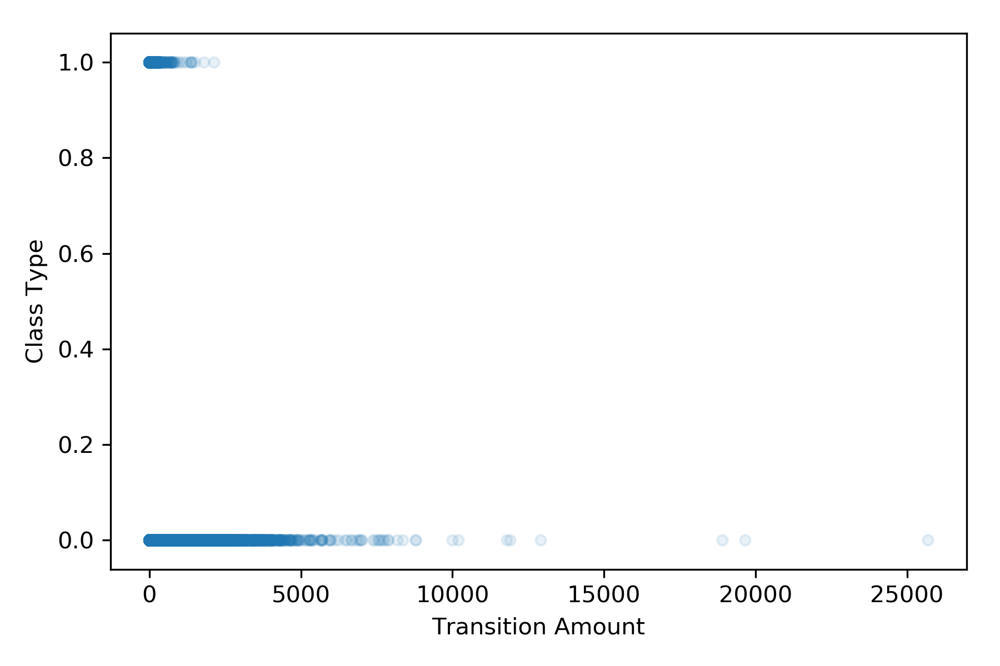
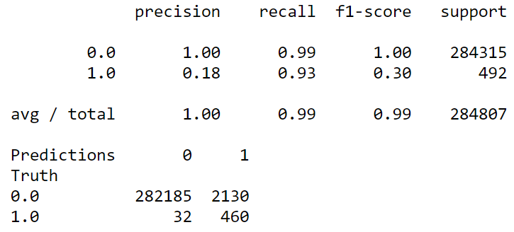
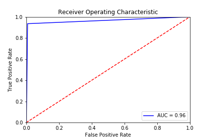
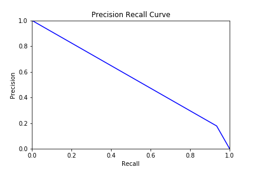

# AI - Credit Card Fraud Analysis
# Introduction: 
Credit card fraud is a wide-ranging term for theft and fraud committed using or involving a payment card, such as credit or debit card, as a fraudulent source of funds in a transaction. The purpose may be to obtain goods without paying, or to obtain unauthorized funds from an account. Credit card fraud is also an adjunct to identity theft. Therefore, it is important for credit card companies to recognize fraudulent transactions to ensure that customers are not charged for the items they did not purchase. However, Artificial Intelligence (AI) supported by Machine Learning (ML) has been able to assist the credit card companies to identify the type of ongoing transaction; either its legal (authentic) or fraudulent (non-authentic). With deep analysis on user’s previous transition history, a fraudulent transition can be predicted and avoided in future. Therefore, we consider to work on __*“Credit Card Fraud Detection System”*__, which can assist any credit card company to predict if fraudulent transition is performed. 
# Dataset Adaption Layout: 
We selected the dataset for *“Credit Card Fraud Detection System”* from a well-known site [Kaggle](https://www.kaggle.com), which hosts many credible datasets for implementing and testing various machine learning related Systems. Currently, the data set “Credit Card Fraud Detection System” contains credit card transactions over a two day collection period in September 2013 by European cardholders. It contains transactions that occurred within two days having a list of 284,807 transactions of which 492 (0.172%) are fraudulent. To maintain confidentiality of sensitive information, principal components analysis (PCA) was applied by the original authors on the dataset containing numerical variables. Additionally the dataset contains Time and Amount, which were not transformed by PCA. Additionally the dataset contains Time and Amount, which were not transformed by PCA. The Time variable contains the seconds elapsed between each transaction and the first transaction in the dataset. The Amount variable is the transaction amount, this feature can be used for example-dependent cost-sensitive learning. The Class variable is the response variable and indicates whether the transaction was fraudulent.
# Model:
*	The data is split into 5 train/test sets
*	For each split, a multi-layer perceptron (MLP) neural network is used having following characteristics:
* 28 input nodes
* 22 nodes for densely connected hidden layer having
* S-shaped rectified linear activation and 20% dropout
* 1 output node with a sigmoid activation.

The models are fit using batches of 1200 observations for up to 100 epochs, although validation loss (binary cross entropy) is monitored to permit early stopping.

The models are implemented in Python using Keras and TensorFlow as the backend

# Raw Data Set Analysis
Data set contains 31 number of input features as nemerical value. Thses fetures include Elapsed Time, Transition Amount, Class Type and features from V1 to V28. The features from V1 to V28 are the principal component obtained with PCA. Moreover, Class Type indicates whether the transition is authentic i.e. "0" or fradulent i.e. "1" and Transaction Amount shows the monetrery value of transcation performed. The data set contains a list of 284,807 transactions of which 0.172 percent are fraudulent. Our system utilizes  28 numerical input features i.e. V1 to V28, as input and outputs based on prediction wether transition is is authentic or fradulent.
## Authentic vs Fradulent Cases 
The first graph shows plot between Transition Amount and Class Type. It is clear that the Class Type 1 transition amount ranging between 0 to 5000 has the most fradulet cases.

## Input Features Visualized 
Following figure represent the frequency of occurance of a particular feature vlaue. It contains 31 sub-plots for Class Type, Elapsed Time, Transition Amount and  features from  V1 to V28. In each sub-plot, y-axis shows the total number of instances occurred and x-axis represents the value of the particular field in the Dataset.
From left to right, in first row, first subplot represents the histogram data of ‘Class Type’ field. We can clearly understand from this sub-plot that there are more number of instances of ‘Class Type 0’, showed by peak, than the number of instances of ‘Class Type 1’.
Second subplot displays Elapsed Time histogram information of all instances of data set. Most of the instances have higher Elapsed Time.
Third subplot shows that more number of instances have very few transition amount and meanwhile, there are some instances in Dataset which have somehow higher transition amount.
Sub-plots for feature V1 to V28, reveals the normal distribution of each feature across the range of negative and positive values. This indicates that our input features are dsitributed normally.

 
# Performance
The final model achieves an overall f1 score of 1.00, with 95% sensitivity (recall) and 19% precision for the positive class. That is, the model correctly identifies 95% of the fraud cases (true positives) but only 19% of the transactions predicted as fraudulent were actually fraudulent. The model catches 95% of the fraudulent cases — it could identify more cases of fraud but would then also have lower precision.

# classification Report

## Receiver Operating Characteristic (ROC)
The ROC curve, in the Figure is another common tool used with binary classifiers. It is similar to the precision/recall curve, but instead of plotting precision versus recall, the ROC curve plots the true positive rate against the false positive rate. There is a tradeoff: the higher the recall (TPR), the more false positives (FPR) the classifier produces. The red dotted line represents the ROC curve of a purely random classifier; a good classifier stays as far away from that line as possible (toward the top-left corner) Hence, ROC curve shows that our classifier gives true positive rate value or Accuracy of approximately 97%.

## Precision Recall Curve

[Contribution guidelines for this project](figures/CONTRIBUTING.md)
